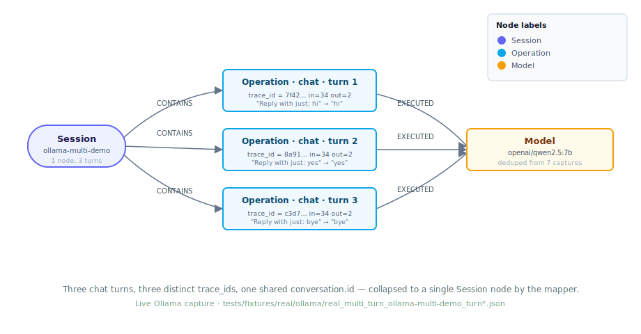
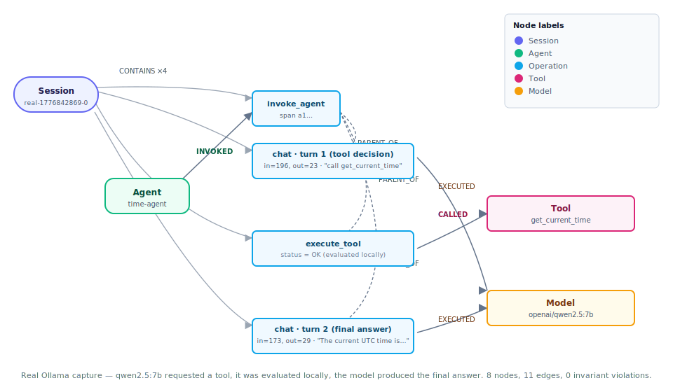

# otel-genai-graph

> **Turn your OpenTelemetry GenAI traces into a graph you can actually ask
> questions of.** Cost per model, agent delegation, tool blast radius,
> session structure — one command each, zero Cypher, mixed vendors, real
> tokens.
[](https://pypi.org/project/otel-genai-graph/)
[](https://pypi.org/project/otel-genai-graph/)
[](https://kums1234.github.io/otel_genai_graph_exporter/)

[](LICENSE)




## See it in one command

Once you've loaded the bundled fixtures plus any live captures you've made, this is cross-vendor cost attribution in a single command:

```bash
$ python tools/render_graph.py --from-neo4j --query cost_by_model --format table

provider   model                   calls  input_tokens  output_tokens
---------  ----------------------  -----  ------------  -------------
anthropic  claude-sonnet-4-5       7      1760          830
openai     qwen2.5:7b              7      541           75
anthropic  claude-opus-4-7         1      500           300
openai     text-embedding-3-small  1      20            0
openai     nomic-embed-text        1      7             0
```

That row mixing Anthropic (synthetic fixtures) with `openai/qwen2.5:7b`
(real local Ollama) and `openai/nomic-embed-text` (real embeddings) is
the point — every provider, classic or cutting-edge, ends up on the
same graph coordinate system.

## What it does

- **Ingests** OTLP/JSON `resourceSpans` from any GenAI-instrumented app — OpenAI, Anthropic, Gemini, Azure OpenAI (classic / v1 / Foundry unified), Ollama, Groq, and anything OpenAI-SDK-compatible.
- **Maps** to a typed graph: `Session` → `Operation` → `Model` / `Tool` / `DataSource`, `Agent` ─`INVOKED`→ `Operation`, `Agent` ─`DELEGATED_TO`→ `Agent`.
- **Writes idempotently** to your choice of backend — Neo4j (graph) or DuckDB (SQL analytics, single-file `.duckdb`). Re-ingesting the same trace is a no-op on both.
- **Streams live or loads files** — ships a `SpanExporter` (plug into any `TracerProvider`) and a file loader (`python -m otel_genai_graph.load trace.json …`).
- **Explores without Cypher** — a library of 10 saved queries (`cost_by_model`, `session_tree`, `agent_delegation`, `failed_tools`, …) exports to interactive HTML (cytoscape.js, single file, no install), node-link JSON, GraphML, or CSV/ASCII tables.
- **Speaks legacy and canonical v1.37** — `gen_ai.system → gen_ai.provider.name`, `generate_content → chat`, plus a priority-ordered `conversation.id` fallback list (`session.id`, `langsmith.trace.session_id`, `traceloop.association.properties.*`). Canonical emitters always win; everything else gets pulled into the same graph.
- **Enforces 7 shape-independent invariants** on every graph — edge endpoint types, Session uniqueness, DAG property of parent / delegation edges, no orphan Models / Tools / DataSources, token-count and time-ordering sanity.

## Backends — Neo4j or DuckDB

Pick one at startup. The mapper, invariants, and OTel exporter are identical
either way — the same `Graph` is built; only the projection differs.

| Backend | Best for | Output shape | Graph viz | Install |
|---|---|---|---|---|
| **Neo4j** | "show me the graph" — agent delegation chains, tool blast radius, session trees rendered as cytoscape HTML | Typed nodes + edges, traversable | ✅ via `tools/render_graph.py` | `pip install 'otel-genai-graph[neo4j]'` |
| **DuckDB** | "give me the numbers" — cost rollups, per-session SQL aggregates, a single-file `.duckdb` you can email | Wide `ops` table + dim tables, denormalised for analytics | ❌ — query directly with SQL | `pip install 'otel-genai-graph[duckdb]'` |

The asymmetry is intentional. DuckDB users want `SELECT … FROM ops` and a
column-oriented file they can hand to anyone with a SQL client; forcing
that into a graph mirror would betray why someone picks DuckDB. Use Neo4j
when you want graph traversals and visual exploration; use DuckDB when
you want analytics, CI gates, or air-gapped portability.

**Switching backend** — CLI flag wins, then env var, then the default
(`neo4j`, preserving prior behaviour):

```bash
# CLI flag
python -m otel_genai_graph.load tests/fixtures/*.json \
    --backend duckdb --duckdb-path ./trace.duckdb

# or env vars
export OTGG_BACKEND=duckdb
export DUCKDB_PATH=./trace.duckdb
python -m otel_genai_graph.load tests/fixtures/*.json
```

`tools/render_graph.py` (the cytoscape HTML / GraphML renderer) is the
Neo4j-only surface. For DuckDB, query directly with the `duckdb` CLI or
any SQL client; the parallel saved-query library lives at
[`src/otel_genai_graph/saved_queries_sql.py`](src/otel_genai_graph/saved_queries_sql.py)
(`cost_by_model`, `cost_by_agent_with_descendants`, `tool_usage`, …).

## 60-second quickstart

```bash
git clone https://github.com/kums1234/otel_genai_graph_exporter.git && cd otel-genai-graph
python3 -m venv .venv && . .venv/bin/activate
pip install -e ".[dev]"                   # dev pulls both backends
pytest                                    # full unit/integration suite

# ── Path A: Neo4j (graph viz, saved Cypher queries) ──
docker run -d --name otel-neo4j \
    -p 17474:7474 -p 17687:7687 \
    -e NEO4J_AUTH=neo4j/testtest neo4j:5
cp .env.example .env                      # fill in NEO4J_*; shell env wins

python -m otel_genai_graph.load tests/fixtures/*.json
python tools/render_graph.py --from-neo4j --query overview \
    --output /tmp/overview --format html && open /tmp/overview.html

# ── Path B: DuckDB (SQL analytics, single-file output) ──
python -m otel_genai_graph.load tests/fixtures/*.json \
    --backend duckdb --duckdb-path ./trace.duckdb

duckdb ./trace.duckdb \
    "SELECT model_provider, model_name, count(*) AS calls,
            sum(coalesce(input_tokens,0)+coalesce(output_tokens,0)) AS tokens
     FROM ops WHERE model_provider IS NOT NULL
     GROUP BY 1,2 ORDER BY tokens DESC"
```

### Configuration

Every CLI (loader, `tools/render_graph.py`, capture scripts) reads its
settings from environment variables. Copy `.env.example` → `.env` at the
project root, uncomment the blocks you need, and they get auto-loaded.

- Works from any working directory — the loader walks up to find `.env`.
- **Shell env always wins** (`override=False`). CI / container env vars
  can't be shadowed by a committed or stale `.env`.
- Soft dep: `python-dotenv` is in `dependencies`; if it's ever missing
  (minimal container), `load_env()` silently no-ops and you fall back to
  explicit exports.
- `.env` is gitignored (`.env`, `.env.local`); only `.env.example` is
  committed.

Minimum viable `.env` for the quickstart:

```bash
NEO4J_URI=bolt://localhost:17687
NEO4J_USER=neo4j
NEO4J_PASSWORD=testtest
```

## Explore without Cypher

Most users don't want to write Cypher. `tools/render_graph.py` bundles a
curated library of the questions people actually ask, and exports the
answer as an interactive HTML viewer, a structured JSON/GraphML file, or
a plain ASCII table.

### Discover

```bash
python tools/render_graph.py --list-queries
python tools/render_graph.py --list-queries --tag cost
python tools/render_graph.py --describe-query session_tree
```

The v0.1 library (10 queries, full list in [`docs/saved-queries.md`](docs/saved-queries.md)):

| Question | Query name | Output type |
|---|---|---|
| Which agents delegated to which? | `agent_delegation` | graph |
| What did I load? | `overview` | graph |
| Full hierarchy of one conversation | `session_tree` | graph |
| Which tools failed, and what did they touch? | `failed_tools` | graph |
| Agent ↔ DataSource access map | `data_source_usage` | graph |
| Token spend per (provider, model) | `cost_by_model` | table |
| Token spend per session | `cost_by_session` | table |
| Token spend per agent (incl. delegated sub-agents) | `cost_by_agent` | table |
| Tool call counts, ranked | `tool_usage` | table |
| Calls by vendor | `provider_distribution` | table |

### Sample: "where is my token spend going?"

```bash
python tools/render_graph.py --from-neo4j --query cost_by_model --format table
```

With the bundled fixtures + a bit of real Ollama traffic loaded:

```
provider   model                   calls  input_tokens  output_tokens
---------  ----------------------  -----  ------------  -------------
anthropic  claude-sonnet-4-5       7      1760          830
openai     qwen2.5:7b              7      541           75
anthropic  claude-opus-4-7         1      500           300
openai     text-embedding-3-small  1      20            0
openai     nomic-embed-text        1      7             0
```

Pipe it into anywhere — spreadsheets, BI, Slack, a Grafana panel:

```bash
python tools/render_graph.py --from-neo4j --query cost_by_model --format csv    > cost.csv
python tools/render_graph.py --from-neo4j --query cost_by_model --format jsonl  | jq '.'
```

### Sample: "multi-turn session across three traces, collapsed"



```bash
python tools/render_graph.py --from-neo4j \
    --query session_tree --param session_id=ollama-multi-demo \
    --output /tmp/multi --format html
open /tmp/multi.html
```

Three chat turns, three **distinct `trace_id`s**, one shared
`gen_ai.conversation.id` — collapsed to a single `Session` node by the
mapper. This is what you can't do with a linear tracer: a turn-by-turn
graph that persists identity across retries, async agents, and
background batches. Real capture, not a synthetic fixture.

### Sample: "show me exactly what happened in that tool call"



```bash
python tools/render_graph.py --from-neo4j \
    --query session_tree --param session_id=real-1776842869-0 \
    --output /tmp/tool --format html
open /tmp/tool.html
```

A real `qwen2.5:7b` on local Ollama requested `get_current_time`, it was
evaluated locally, the model produced the final answer. The graph shows
the whole flow: `Agent` ─`INVOKED`→ `invoke_agent` ─`PARENT_OF`→ two
`chat` + one `execute_tool`, with `EXECUTED` and `CALLED` edges
fanning out to the shared `Model` and `Tool` nodes. 8 nodes, 11 edges, 0
invariant violations.

Every HTML output is **one self-contained file** (cytoscape.js loaded
from CDN, everything else inline). Email it to a non-technical
stakeholder; they get pan / zoom / hover / click for node properties.
No server, no Neo4j required on the receiving end.

### Sample: any fixture, offline, no Neo4j

```bash
python tools/render_graph.py --fixture tests/fixtures/multi_agent.json \
    --output /tmp/multi-agent --format all
# → /tmp/multi-agent.{dot,html,json,graphml} in one shot
```

`--format all` covers the four dep-free formats. Add `.svg` / `.png`
output with `brew install graphviz` (or `apt-get install graphviz`).

### Output formats

| Format    | Flag              | Shape  | When to use                                                 |
|-----------|-------------------|--------|-------------------------------------------------------------|
| `html`    | `--format html`   | graph  | Share with humans. Interactive, single file.                |
| `json`    | `--format json`   | graph  | Feed into D3, Observable, another graph viz, or your tests. |
| `graphml` | `--format graphml`| graph  | Gephi / yEd for force-directed layout + centrality metrics. |
| `dot`     | `--format dot`    | graph  | Pipe into your own `dot` for PDFs / papers.                 |
| `svg`/`png`| `--format svg`   | graph  | Docs / READMEs. Requires graphviz installed.                |
| `table`   | `--format table`  | table  | Terminal output for aggregations.                           |
| `csv`     | `--format csv`    | table  | Spreadsheets, BI tools.                                     |
| `jsonl`   | `--format jsonl`  | table  | Pipe into `jq`, stream-processors, dashboards.              |

The CLI refuses to render a table query as HTML or a graph query as CSV,
so you can't accidentally produce junk output.

### Custom Cypher — for when the saved library isn't enough

```bash
python tools/render_graph.py --from-neo4j \
    --cypher "MATCH (a:Agent)-[:DELEGATED_TO*]->(b:Agent) RETURN a, b" \
    --output /tmp/delegations --format html
```

## Graph schema (v0.1)

| Node          | Natural key                | Sourced from                                 |
|---------------|----------------------------|----------------------------------------------|
| `Session`     | `id`                       | `gen_ai.conversation.id` (+ legacy fallbacks)|
| `Agent`       | `id`                       | `gen_ai.agent.id`                            |
| `Model`       | `(provider, name)`         | `gen_ai.provider.name` + `gen_ai.response.model` |
| `Tool`        | `name`                     | `gen_ai.tool.name`                           |
| `DataSource`  | `id`                       | `gen_ai.data_source.id`                      |
| `Operation`   | `span_id`                  | span id                                      |

| Edge              | Direction                   | Emitted when                                         |
|-------------------|-----------------------------|------------------------------------------------------|
| `CONTAINS`        | `Session → Operation`       | Operation carries a conversation id                  |
| `EXECUTED`        | `Operation → Model`         | Op type ∈ {chat, text_completion, embeddings}        |
| `INVOKED`         | `Agent → Operation`         | Op type ∈ {invoke_agent, create_agent}               |
| `CALLED`          | `Operation → Tool`          | Op type = execute_tool                               |
| `RETRIEVED_FROM`  | `Operation → DataSource`    | Op carries `gen_ai.data_source.id`                   |
| `PARENT_OF`       | `Operation → Operation`     | span has parent_span_id                              |
| `DELEGATED_TO`    | `Agent → Agent`             | child `invoke_agent` under a different parent Agent  |
| `ACCESSED`        | `Agent → DataSource`        | agent-owned Op retrieves from a data source          |

See [`docs/schema.md`](docs/schema.md) for the full reference, extension seams, and open questions for v0.2.

## Raw Cypher (power users)

If the saved-query library doesn't cover your question, the Neo4j
browser (`http://localhost:17474`) is always available. A handful of
useful queries for reference, each also available as a saved query:

```cypher
// agent delegation graph across all loaded traces
// (saved query: agent_delegation)
MATCH p = (a:Agent)-[:DELEGATED_TO*]->(b:Agent) RETURN p

// cost / token attribution per (provider, model)
// (saved query: cost_by_model)
MATCH (o:Operation)-[:EXECUTED]->(m:Model)
RETURN m.provider, m.name,
       count(*)                  AS calls,
       sum(o.input_tokens)       AS in_tok,
       sum(o.output_tokens)      AS out_tok
ORDER BY calls DESC

// blast radius, which agents/sessions did a failing tool touch?
// (saved query: failed_tools — graph shape)
MATCH (t:Tool)<-[:CALLED]-(op:Operation {status:"ERROR"})
      <-[:PARENT_OF*]-(ancestor:Operation)
      <-[:CONTAINS]-(s:Session)
RETURN t, s, collect(DISTINCT ancestor) AS affected_ops
```

To run one-off ad-hoc Cypher through the export pipeline (HTML/JSON/etc.):

```bash
python tools/render_graph.py --from-neo4j \
    --cypher "MATCH (o:Operation {status:'ERROR'}) RETURN o" \
    --output /tmp/errors --format html
```

## Validation pipeline

Four independent data sources catch different bug classes:

1. **Hand-written fixtures**, 6 canonical cases in `tests/fixtures/*.json`. Each ships an `expected_graph` block with hand-counted node/edge totals; the mapper has to match exactly.
2. **Parametric synthesizer**, [`tests/generate_traces.py`](tests/generate_traces.py) emits thousands of deterministic OTLP traces across five shapes (`simple`, `agent_tool`, `multi_agent`, `rag`, `multi_turn`) with a **chaos mode** that introduces dropped attributes, orphaned children, reordered spans, and corrupted trace_ids. The mapper must stay correct on clean traces and must not crash on chaos.
3. **Real-SDK capture**, [`tests/capture_real_traces.py`](tests/capture_real_traces.py) calls actual LLMs (Anthropic, OpenAI, Gemini, Azure OpenAI classic / v1 / Foundry, Ollama) with a `BudgetGuard` that refuses to run past a cap. Five shapes: `chat`, `agent_tool`, `embeddings`, `multi_turn`, `tool_call` (with real tool execution).
4. **Upstream-instrumentor capture**, [`tests/capture_with_instrumentor.py`](tests/capture_with_instrumentor.py) runs spans through Python Contrib's own `OpenAIInstrumentor` / `GoogleGenAiSdkInstrumentor` and dumps what they emit. This is how we found that the Google instrumentor emits the pre-v1.37 `gen_ai.system="gemini"` + `operation.name="generate_content"` shape, now handled by the mapper's legacy-compat table.

All four feed into a **shape-independent invariant test suite** that checks 7 structural properties across every captured graph. See [`docs/mapping.md`](docs/mapping.md) for the full contract and [`tests/test_invariants.py`](tests/test_invariants.py) for the enforcement.

## Supported providers

Out of the box, with the bundled capture scripts:

| Provider           | CLI `--provider` value | Notes                                      |
|--------------------|------------------------|--------------------------------------------|
| Anthropic          | `anthropic`            | `ANTHROPIC_API_KEY`                        |
| OpenAI             | `openai`               | `OPENAI_API_KEY` (+ `OPENAI_BASE_URL` for Ollama/Groq) |
| Azure OpenAI       | `azure_openai`         | classic `/openai/deployments/…` path       |
| Azure OpenAI v1    | `azure_openai_v1`      | new `/openai/v1/` path (Foundry portal)   |
| Azure AI Inference | `azure_inference`      | Foundry unified inference endpoint         |
| Google AI Studio   | `google`               | `GEMINI_API_KEY`; free tier works          |
| Ollama             | `openai` + `OPENAI_BASE_URL=http://localhost:11434/v1/` | local, unlimited, $0 |

**Free paths**: Google AI Studio (no credit card, 1,500 requests/day on Flash), Ollama (local), Groq free tier.

## Streaming export

```python
from opentelemetry import trace
from opentelemetry.sdk.trace import TracerProvider
from opentelemetry.sdk.trace.export import BatchSpanProcessor
from otel_genai_graph.exporter import Neo4jGenAIExporter
from otel_genai_graph.neo4j_sink import Neo4jSink

sink = Neo4jSink("bolt://localhost:17687", "neo4j", "testtest")
sink.connect()
sink.ensure_schema()

provider = TracerProvider()
provider.add_span_processor(BatchSpanProcessor(Neo4jGenAIExporter(sink)))
trace.set_tracer_provider(provider)
# any instrumented code below this line streams into the graph
```

See [`tests/live_export_demo.py`](tests/live_export_demo.py) for a runnable walkthrough.

## Status

**v0.1, reference implementation, 833 tests passing.**
All components live: schema, mapper (with legacy-compat canonicalisation), Neo4j sink (MERGE-based, idempotent), SpanExporter, file loader, cost table, synthesizer, real-API capture, upstream-instrumentor capture, invariants, saved-query library, HTML / JSON / GraphML / CSV / ASCII-table export.

Known open questions, tracked in [`docs/schema.md`](docs/schema.md#open-questions-v02-candidates):

- `Resource` nodes aren't currently emitted (schema has the label; mapper skips it to keep v0.1 simple).
- Streaming spans (partial output): we take the final span only.
- Cost attribution lives as `Operation` properties, not a dedicated `Budget` node, deferred until a concrete UX asks for it.

## Contributing

See [`CONTRIBUTING.md`](CONTRIBUTING.md) for the dev loop, adding fixtures, adding provider adapters, and the invariant contract.

## Contributors

Maintained by [@kums1234](https://github.com/kums1234). Any non-trivial
contribution — code, docs, bug report, test fixture, real-trace capture,
provider adapter, design feedback — earns a row in
[`CONTRIBUTORS.md`](CONTRIBUTORS.md). Instructions for getting listed
are in that file.

## License

Released under the [Apache License, Version 2.0](LICENSE) (SPDX:
`Apache-2.0`). See [`NOTICE`](NOTICE) for attribution requirements
when redistributing.

You may use, modify, and distribute this software for any purpose,
including commercial use, with the obligations spelled out in the
license — most notably preserving copyright/notice files and stating
the changes you've made.
